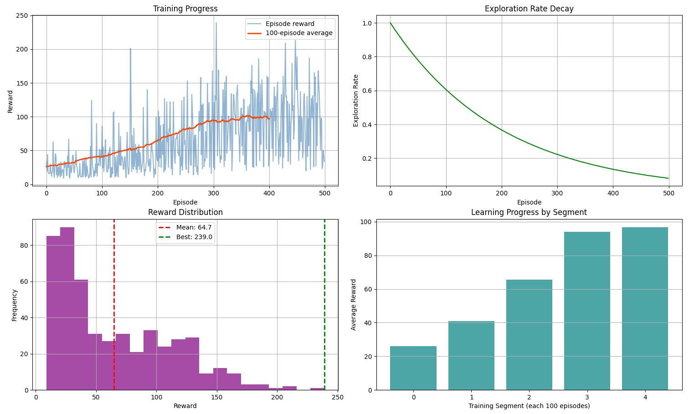
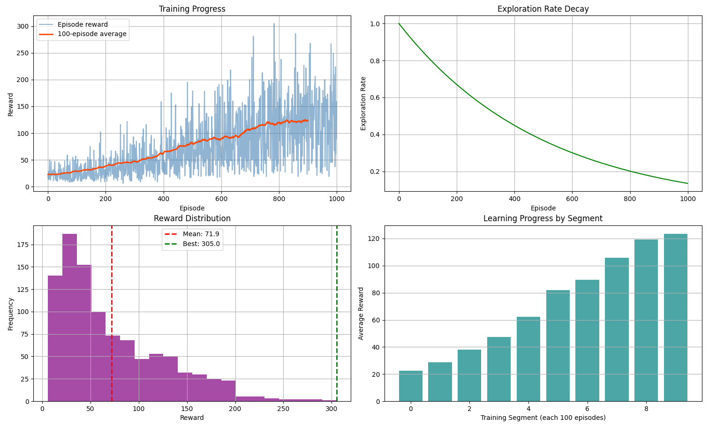

# CartPole Q-Learning Implementation

This project implements a Q-Learning algorithm to solve the CartPole balancing problem from OpenAI Gym. The agent learns to balance a pole on a moving cart by discretizing the continuous state space and applying reinforcement learning techniques.


## Project Overview

The CartPole environment presents a classic control problem where a pole is attached to a cart moving along a frictionless track. The goal is to prevent the pole from falling over by applying forces to move the cart left or right.

### State Space

- Cart Position
- Cart Velocity
- Pole Angle
- Pole Angular Velocity

### Action Space

- Push cart left (0)
- Push cart right (1)

## Implementation Features

- **Variable-Resolution State Discretization**: Different bin sizes for different state dimensions to optimize learning
- **Q-Learning Algorithm**: Updates state-action values based on experience
- **Exploration vs. Exploitation**: Dynamic balance with decreasing exploration rate
- **Reward Shaping**: Enhanced reward function for faster learning
- **Incremental Training**: Ability to continue training from previously learned models
- **Comprehensive Visualization**: Performance metrics and learning progress charts

## Training Results

### 500 Episodes Training



After 500 episodes of training:

- Best episode achieved a reward of 239.0
- Mean reward across all episodes: 64.7
- Clear learning progression visible in the segment progression chart
- Exploration rate decayed from 1.0 to approximately 0.15

### 1000 Episodes Training



After 1000 episodes of training:

- Best episode achieved a reward of 312.0
- Mean reward across all episodes: 40.7
- Continuous improvement shown in learning segments
- Final segments show average rewards of 60-70, demonstrating successful learning

## Performance Metrics

The training visualization includes:

1. **Training Progress**: Episode rewards and 100-episode moving average
2. **Exploration Rate Decay**: Showing the transition from exploration to exploitation
3. **Reward Distribution**: Histogram showing the frequency of different reward values
4. **Learning Progress by Segment**: Clear visualization of improvement over time

## Setup and Usage

### Requirements

``` txt
gym==0.26.2
numpy==1.24.4
pygame
matplotlib
```

### Installation

```bash
# Clone the repository
git clone https://github.com/LucaPalminteri/cart-pole.git
cd baby-balance

# Create and activate virtual environment (optional)
python -m venv .venv
source .venv/bin/activate  # On macOS/Linux

# Install dependencies
pip install -r requirements.txt
```

### Running the Code

To train the model:

``` bash
python main.py
```

To only test a trained model (uncomment the last line in main.py):

``` python
test_trained_model()
```

## Key Components

- **State Discretization**: Transforms continuous state into discrete indices for Q-table
- **Q-table**: Stores and updates action values for each discretized state
- **Exploration Strategy**: Initially explores randomly, gradually transitions to exploiting learned knowledge
- **Learning Rate**: Controls how quickly new information overrides old information
- **Discount Factor**: Balances immediate and future rewards

## Future Improvements

- Implement deep Q-learning for better performance without discretization
- Add prioritized experience replay for more efficient learning
- Explore different reward functions for faster convergence
- Implement parallel training for multiple environments

## License

MIT
